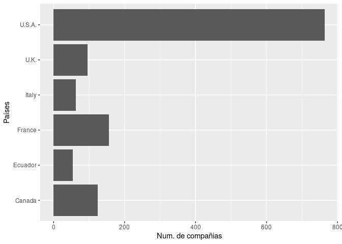

  
“El chocolate”

================
MVAP, MVAP2, MVAP3
2025-12-10

<!-- Antes de comenzar !!!
debes crear el archivo con las referencias de R y los paquetes que vayas a utilizar.  
Puedes actualizar el archivo en cualquier momento, sólo copia en la terminal el siguiente código y añade el nuevo paquete a la lista, se creará un nuevo archivo con las referencias en el formato adecuado "BibTeX". De forma automática incluye la referencia de R-->

<!-- knitr::write_bib(c(.packages(), 'dplyr', 'ggplot2', 'knitr', 'tinytex'), 'libraries.bib') -->

<!-- Inicio Rmd -->

<!-- Configuración global de los bloques de código, `echo = TRUE` -> todo el código utilizado en este documento aparecerá en el documento final salvo que se expecifique lo contrario, a excepción de este bloque de código, `include=TRUE`  -->

<!-- Para generar títulos, subtítulos etc se usa # el número de # determina el estilo y el formato del texto -->

## Intruducción

### 1.1 El chocolate

<!-- Trabajamos los diferentes estilos de text (negrita, cursiva, tachado, superíndice y subíndice), notas a pie de página [^N], citas > y referencias [@código] -->

<!-- En HTML podemos usar la etiqueda de css para usar diferentes colores en el texto:  -->

<!--  -->

El **chocolate** (del náhuatl,
*xocoatl*)[^1] [^2] es el alimento que se obtiene mezclando azúcar con
dos producto**s** que
derivan de l**a**
manipulación de las ~~semillas~~ del cacao: la masa del cacao y la
manteca de cacao. A partir de esta combinación básica se elaboran los
distintos tipos de chocolate que dependen de la proporción entre estos
elementos y de su mezcla, o no, con otros productos ya sea como leche,
colorante, y/o frutos secos ([Kiss et al.
2024](#ref-kiss_modified_2024)).

En 1896 El famoso gastrónomo francés J. A. Brillat-Savarin definió
chocolate de la siguiente manera

> “Se ha convenido en dar el nombre de chocolate a la mezcla compuesta
> de la semilla del árbol del cacao tostada, que lleva azúcar y canela;
> tal es la definición clásica del chocolate. El azúcar forma parte
> integrante, porque con cacao sólo resulta únicamente pasta de cacao y
> no chocolate.”

### 1.2 Los datos

<!-- cargar las librerias que vamos a utilizar, queremos que el código se ejecute, pero no que aparezca en el documento final, también excluímos los avisos y mensajes -->

<!-- Leer los datos desde el fichero que está en la misma carpeta que Rmarkdown. Si el fichero está en otra carpeta actualizar la localización del archivo -->

<!-- Trabajamos los links a páginas/archivos externos  y el código R en línea -->

Los datos de este proyectos fueron descargados desde
[kaggle](https://www.kaggle.com). Participaron 416 compañias fabricantes
de cocholate y se incluyeron chocolates de 100 paises diferentes.

<!-- insertar nueva página -->

<!-- Primera vista de los datos -->

| Company..Maker.if.known. | Specific.Bean.Origin.or.Bar.Name | REF | Review.Date | Cocoa.Percent | Company.Location | Rating | Bean.Type | Broad.Bean.Origin |
|:--:|:--:|:--:|:--:|:--:|:--:|:--:|:--:|:--:|
| A. Morin | Agua Grande | 1876 | 2016 | 63% | France | 3.75 |  | Sao Tome |
| A. Morin | Kpime | 1676 | 2015 | 70% | France | 2.75 |  | Togo |
| A. Morin | Atsane | 1676 | 2015 | 70% | France | 3.00 |  | Togo |
| A. Morin | Akata | 1680 | 2015 | 70% | France | 3.50 |  | Togo |
| A. Morin | Quilla | 1704 | 2015 | 70% | France | 3.50 |  | Peru |
| A. Morin | Carenero | 1315 | 2014 | 70% | France | 2.75 | Criollo | Venezuela |
| A. Morin | Cuba | 1315 | 2014 | 70% | France | 3.50 |  | Cuba |
| A. Morin | Sur del Lago | 1315 | 2014 | 70% | France | 3.50 | Criollo | Venezuela |
| A. Morin | Puerto Cabello | 1319 | 2014 | 70% | France | 3.75 | Criollo | Venezuela |
| A. Morin | Pablino | 1319 | 2014 | 70% | France | 4.00 |  | Peru |

Tabla 1: Diez primeras filas

Los datos tienen 1795 entradas. Si los ordenamos por número de empresas:

<!-- calcular el número de compañias por pais con la función `count` y guardar los datos ordenados de forma descendiente en variable nueva -->

<!-- Utilizar la variable nueva para hacer un gráfico de barras incluyendo el pie de figura y la posición -->

Fig 1. Paises top productores de barras de chocolate

### 1.3 Hipótesis

Nuestra hipótesis …

## Materiales y Methods

<!-- Para indicar una referencia se utiliza [@codigo] -->

Para llevar a cabo el análisis usamos R ([R Core Team
2024](#ref-R-base)) con las librerias dplyr ([Wickham et al.
2023](#ref-R-dplyr)) y … Para la creación de este informe hemos
utilizado el paquete ….

## Resultados

Los chocolates … (Fig 2).

<figure>

<figcaption aria-hidden="true">Fig 2. relación entre el ratio y el
porcentaje de cacao</figcaption>
</figure>

## Conclusiones

Los datos ….

------------------------------------------------------------------------

<!-- Para asegurar la reproducibilidad de los resultados es necsario conocer el sistema operativo y la version de software y paquetes -->

## Información de la sesión y referencias

    ## R version 4.5.2 (2025-10-31)
    ## Platform: x86_64-pc-linux-gnu
    ## Running under: Ubuntu 20.04.6 LTS
    ## 
    ## Matrix products: default
    ## BLAS:   /usr/lib/x86_64-linux-gnu/openblas-pthread/libblas.so.3 
    ## LAPACK: /usr/lib/x86_64-linux-gnu/openblas-pthread/liblapack.so.3;  LAPACK version 3.9.0
    ## 
    ## locale:
    ##  [1] LC_CTYPE=C.UTF-8       LC_NUMERIC=C           LC_TIME=C.UTF-8       
    ##  [4] LC_COLLATE=C.UTF-8     LC_MONETARY=C.UTF-8    LC_MESSAGES=C.UTF-8   
    ##  [7] LC_PAPER=C.UTF-8       LC_NAME=C              LC_ADDRESS=C          
    ## [10] LC_TELEPHONE=C         LC_MEASUREMENT=C.UTF-8 LC_IDENTIFICATION=C   
    ## 
    ## time zone: UTC
    ## tzcode source: system (glibc)
    ## 
    ## attached base packages:
    ## [1] stats     graphics  grDevices utils     datasets  methods   base     
    ## 
    ## other attached packages:
    ## [1] ggplot2_4.0.1 dplyr_1.1.4  
    ## 
    ## loaded via a namespace (and not attached):
    ##  [1] vctrs_0.6.5        nlme_3.1-168       cli_3.6.5          knitr_1.50        
    ##  [5] rlang_1.1.6        xfun_0.54          generics_0.1.4     S7_0.2.1          
    ##  [9] labeling_0.4.3     glue_1.8.0         htmltools_0.5.9    scales_1.4.0      
    ## [13] rmarkdown_2.30     grid_4.5.2         evaluate_1.0.5     tibble_3.3.0      
    ## [17] fastmap_1.2.0      yaml_2.3.11        lifecycle_1.0.4    compiler_4.5.2    
    ## [21] RColorBrewer_1.1-3 pkgconfig_2.0.3    mgcv_1.9-3         rstudioapi_0.17.1 
    ## [25] lattice_0.22-7     farver_2.1.2       digest_0.6.39      R6_2.6.1          
    ## [29] tidyselect_1.2.1   splines_4.5.2      pillar_1.11.1      magrittr_2.0.4    
    ## [33] Matrix_1.7-4       withr_3.0.2        tools_4.5.2        gtable_0.3.6

Kiss, Tibor, Zoltán Karácsony, Adrienn Gomba-Tóth, Kriszta Lilla
Szabadi, Zsolt Spitzmüller, Júlia Hegyi-Kaló, Thomas Cels, et al. 2024.
“A Modified CTAB Method for the Extraction of High-Quality RNA from
Mono-and Dicotyledonous Plants Rich in Secondary Metabolites.” *Plant
Methods* 20 (1): 62. <https://doi.org/10.1186/s13007-024-01198-z>.

R Core Team. 2024. *R: A Language and Environment for Statistical
Computing*. Vienna, Austria: R Foundation for Statistical Computing.
<https://www.R-project.org/>.

Wickham, Hadley, Romain François, Lionel Henry, Kirill Müller, and Davis
Vaughan. 2023. *Dplyr: A Grammar of Data Manipulation*.
<https://dplyr.tidyverse.org>.

[^1]: Hernández Triviño, Ascensión (2013-12). «Chocolate: historia de un
    nahuatlismo». Estudios de cultura náhuatl 46: 37-87. ISSN 0071-1675.
    Consultado el 7 de marzo de 2021.

[^2]: Real Academia Española. «chocolate». Diccionario de la lengua
    española (23.ª edición).
